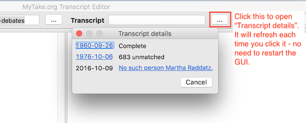
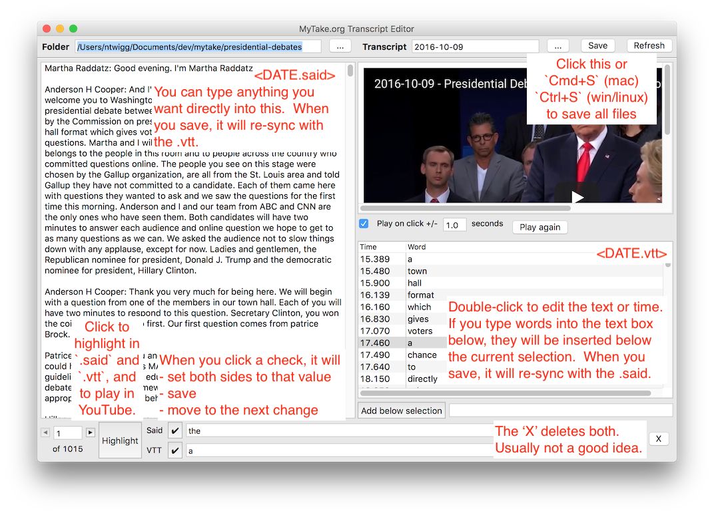

# How to sync a transcript

Syncing a video to its transcript has these steps:

1. Open the transcript gui with `gradlew transcriptGui`.
2. Copy-paste the transcript from [debates.org](http://debates.org/index.php?page=debate-transcripts), and name it as `<DATE>.said` in the `presidential-debates` folder.
3. Add the people and roles to `<DATE>.json`, `all_people.ini`, and `all_roles.ini` (`transcriptGui` will help you find typos).  You can look at `1960-09-26` for a finished example.
4. Use `transcriptGui` to sync the `.said` file and the `.vtt` file.

Here are some steps in more detail:

## 3. Add the people and roles to `<DATE>.json`, `all_people.ini`, and `all_roles.ini`

In the transcriptGui, click "..." to open the details of every transcript in the folder.

- If the date is underlined, that means all of the speakers in the transcript are valid, and you can can start syncing.  The dialog will tell you how many sections remain to be synced.
- If the date is not underlined, then there was an error loading the transcript - probably because a name doesn't match somewhere in `<DATE>.said`, `<DATE>.json`, `all_people.ini`, or `all_roles.ini`. If you click the underlined error, it will print the stack trace to console, which should have the line number of the error.

## 4. Use `transcriptGui` to sync the `.said` file and the `.vtt` file.

When syncing the transcript, the normal loop is:

1. Press `Highlight` to hear what was said.
2. Press the checkmark for the one that was correct.

Occasionally, neither side will be right.  In those situations, you can edit either the `.said` or the `.vtt` directly.  If you make any manual edits, you cannot use the checkmarks again until after you have saved.

